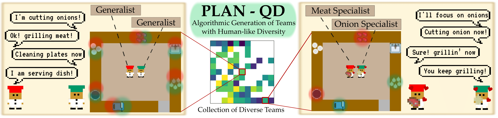

# Algorithmic Prompt Generation for Diverse Human-like Teaming and Communication with Large Language Models



This repository is the official implementation of "Algorithmic Prompt Generation for Diverse Human-like Teaming and Communication with Large Language Models".

For more information, refer to the following links:

- [arXiv](https://arxiv.org/abs/2504.03991)
<!-- - [Supplemental Website](https://dsagepaper.github.io) -->

## Contents

<!-- vim-markdown-toc GFM -->

* [Manifest](#manifest)
* [Installation](#installation)
  * [Repository Setup](#repository-setup)
  * [LLM Setup](#llm-setup)
* [Instructions](#instructions)
  * [Logging Directory Manifest](#logging-directory-manifest)
  * [Running an Experiment](#running-an-experiment)
  * [Reloading](#reloading)
* [Reproducing Paper Results](#reproducing-paper-results)
* [License](#license)

<!-- vim-markdown-toc -->

## Manifest

- `config/`: [hydra](https://hydra.cc/docs/intro/) configuration files.
- `src/`: Python implementation and related tools.
- `overcooked_ai/`: Overcooked (https://github.com/HumanCompatibleAI/overcooked_ai) submodule
<!-- - `scripts/`: Bash scripts. -->

## Installation

### Repository Setup

Create a virtual environment in **python 3.9** and download dependencies from requirements.txt.

Next, create an editable package for the overcooked environment

```
cd overcooked_ai
pip install -e .
```

### LLM Setup

We provide some additional details on how to setup the repository to work with the following language model frameworks:
- **HuggingFace**: Ensure that you set the environment variable of HF_TOKEN to the appropriate authentication token. See http://huggingface.co for more information.
- **OpenAI**: Set the OPENAI_API_KEY environment variable similar to above. See https://platform.openai.com/playground for more information.
- **SGLang (Recommended)**: Please see https://github.com/sgl-project/sglang for details on how to start the server locally.

## Instructions

### Logging Directory Manifest

Regardless of where the script is run, the log files and results are placed in a
logging directory in `outputs/`. The directory's name is of the form
`%Y-%m-%d/%H-%M-%S/`, e.g.
`2025-03-24/17-12-17`. Inside each directory are the
following files:

```text
- .hydra/  # Hydra configuration files
- archive/  # QD Archive results
- archive_history.pkl  # Entire archive history
- reload.pkl  # Reload file to restart failed experiments
- qdllm.log  # Log file for QD-LLM experiments
```

### Running an Experiment

To run an experiment, use:

```
python -m src.qdllm
```

### Reloading

While the experiment is running, its state is saved to `reload.pkl` in the
logging directory. If the experiment fails, e.g. due to memory limits, time
limits, or network connection issues, `reload.pkl` may be used to continue the
experiment. To do so, execute the same command as before, but append the path to
the logging directory of the failed experiment.

```
python -m src.qdllm --experimental-rerun <path_to_dir>/.hydra/config.pickle
```

## Reproducing Paper Results

The `config/` directory contains the config files required to run the
experiments shown in the paper. Below is a brief description of each config:

```
config/
    manager/
        agents/
            llm.yaml: LLM agent configuration
        communication/
            without_communication: *Without* communication condition
            with_communication: *With* communication condition
        env/
            module_cfg/
                grid/: Contains open, ring, hallway, and forced coordination hallway layouts:
                prompt/
                    steakhouse_prompt: LLM agent steakhouse prompt framework
            steakhouse.yaml: Steakhouse configuration file
        model/
            quantization_config: Contains 4bit and 8bit quantization config files for local huggingface models
            llama_8b_hf.yaml: Meta Llama 3 8B Instruct (see https://huggingface.co/models)
            llama_70b_hf.yaml: Meta Llama 3 70B Instruct (see https://huggingface.co/models)
            llama_70b_sglang.yaml: Meta Llama 3 70B Instruct using SGLang (see https://github.com/sgl-project/sglang)
        qd/
            measures/: All 9 workload measure files used for QD
            x0/x0: Initial prompt for QD experiments
            planqd.yaml: PLAN-QD configuration
            random.yaml: Random mutation configuration
        default.yaml: Configuration script
```

To reproduce the results from the paper, modify the configuration in default.yaml for manager/communication, manager/qd. To change the layout, change the value in manager.env.steakhouse.grid.

For example:
```
python -m src.qdllm \
  manager/env/module_cfg/grid=open \
  manager/qd=planqd \
  manager/communication=with_communication
```

will run PLAN-QD on the open layout with communication. Additionally:

```
python -m src.qdllm \
  manager/env/module_cfg/grid=hallway \
  manager/qd=random \
  manager/communication=without_communication
```
will run the random mutation baseline on the hallway layout without communication. 

## License

This code is released under the [MIT License](LICENSE), with the following
exceptions:

- `overcooked_ai` is adapted from the
  [Overcooked AI Framework](https://github.com/HumanCompatibleAI/overcooked_ai), which is released under the [MIT License](https://github.com/HumanCompatibleAI/overcooked_ai/blob/master/LICENSE).

- `src/envs/steakhouse` is adapted from the [Steakhouse Framework](https://github.com/SophieHsu/FOV-aware-planner) proposed in [this paper](https://sophiehsu.github.io/data/papers/2025_ICRA.pdf), which is released under the [MIT License](https://github.com/SophieHsu/FOV-aware-planner/blob/main/LICENSE).